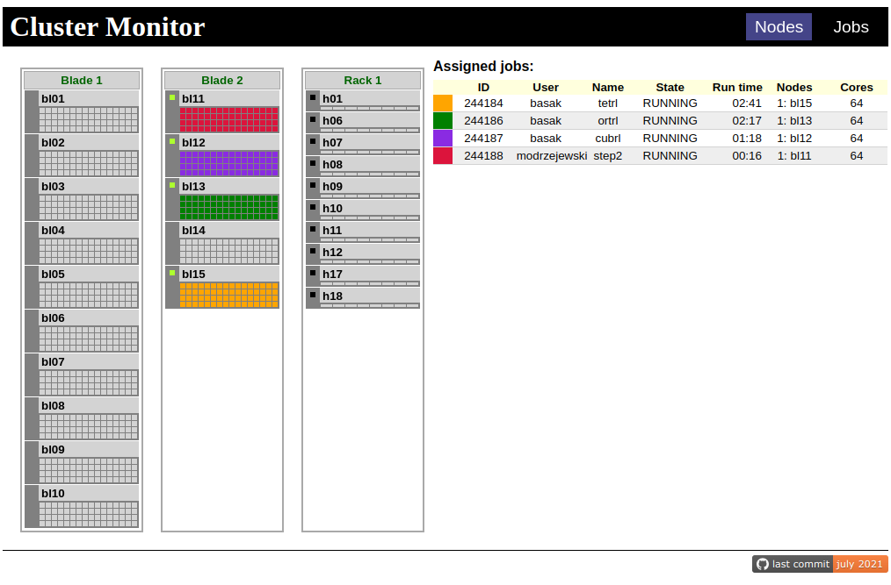

# slurm-monitor
Web monitor for the slurm cluster. This project is born out of the frustration with brittleness and complication of slurm-web project which looks nice and when it works is very useful but it is enough to look at it the wrong way for it to brake. 


So I decided to build simpler solution for my cluster. I have used [HTMX](http://htmx.org/) to build active parts (without a single javascript line), Flask and jinja for application server and slurmrestd's REST API server. The final product is highly specific to my environment - especially the nodes display template and logic. But it is very easy to adapt to different circumstances. Here it is showing status of my cluster.



I have ported the code to work with slurm native REST server and added small tweaks to the display (e.g. cpu-load display).
In the future I intend to make it easier to configure and maybe extend it with reservations and other displays. 

Beware - this is a weekend hack project. I got it working in literal 12 hours and ported it in next 12 hours, so it is not polished, documented etc. But, I believe you can adapt it to your own cluster (if you have slurm restapi server running) by simply modifying nodes.html and node.html templates to fit your setup. I would welcome any contributions - particularly some configuration system and changes to make it more universal and easier to install/configure.

## Installation

You need to install it from source for now. I know this is suboptimal. But, it is a standard, simple Flask app. It needs Flask+Jinja2 and httpx. Just follow standard Flask install docs. Below are my notes reproducing installation on my system. If you spot any errors, please let me know!

Following text assumes that you have `apache2` and `slurmrestd` running on the same host, configured to run as `www-data` user and listening on unix socket `/run/slurmrestd/slurmrestd.socket`. You need to make sure it works first. You can verify it using `curl` (as www-data user or as root. If it works only as root you have to check the user of the slurmrestd service):
```
curl --unix-socket /run/slurmrestd/slurmrestd.socket localhost/slurm/v0.0.38/ping
```
you should get response similar to this (the version of openapi may be different, depending on the version of your slurm - here: 22.05.8 from debian 12):
```
{
  "meta": {
    "plugin": {
      "type": "openapi\/v0.0.38",
      "name": "Slurm OpenAPI v0.0.38"
    },
    "Slurm": {
      "version": {
        "major": 22,
        "micro": 8,
        "minor": 5
      },
      "release": "22.05.8"
    }
  },
  "errors": [
  ],
  "pings": [
    {
      "hostname": "slurm",
      "ping": "UP",
      "status": 0,
      "mode": "primary"
    }
  ]
}
```


The basic install steps are as follows:

- Clone the repo somewhere as normal user:
    ```
    git clone https://github.com/jochym/slurm-monitor.git
    ``` 
- Make a directory inside the www server tree (e.g. `/var/www/cluster`)
- Put following into the site config for apache (`/etc/apache/sites-enabled/cluster.conf`):
    ```
    WSGIDaemonProcess slurm-monitor python-home=/var/www/cluster/venv

    WSGIProcessGroup slurm-monitor
    WSGIApplicationGroup %{GLOBAL}

    WSGIScriptAlias /cluster /var/www/cluster/monitor.wsgi
    <Directory /var/www/cluster/>
        Order allow,deny
        Allow from all
        Require all granted
    </Directory>
    ```
- Install `libapache2-mod-wsgi-py3` (for debian, for others you need to figure out the name of the package).
- Enable the wsgi module (`a2enmod wsgi`) and restart apache.
- Go to the `/var/wwww/cluster` and install flask and httpx into virtual envronment (as root or user with writing access to this directory):
    ```
    python3 -m venv venv
    source venv/bin/activate
    pip install flask httpx
    ```
- Make symbolic links from the cloned repo to this directory. This way you can update the install by simple `git pull` in your clone. You can also easily fork your clone to adapt the package to your system. Again, run this inside `/var/www/cluster` directory:
    ```
    ln -s /home/user/slurm-monitor/{slurm_monitor.py,monitor.wsgi,static,templates} .
    ```

## Configuration

As a minimum you will need to change restapi server URL in `slurm_monitor.py` and probably modify `templates/nodes.html` and `templates/node.html` to fit your setup. To make your work easier you can use flask's development server. In your clone make a virtual environment with `flask` and `httpx`. Switch to the correct user (e.g. `www-data`) activate the environment and run in the flask development server. First create the virtual environment (you need to do this only once):
```
cd slurm-monitor
python3 -m venv venv 
source venv/bin/activate
pip install flask httpx
```
Then run the server as `www-data` user:
```
sudo su -s /bin/bash www-data
cd /home/user/slurm-monitor
source venv/bin/activate
flask --app slurm_monitor run --host=0.0.0.0 --debug
```
If you are on the same machine you can use `localhost` instead of `0.0.0.0`. Now connect to the server on port `5000`. You should see the "Nodes" page. The screenshot from my cluster is at the top. You can edit any files and the server will monitor any changes and automatically reload the application. 